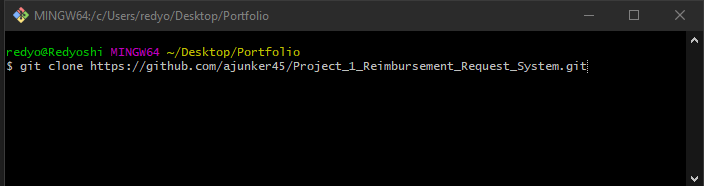
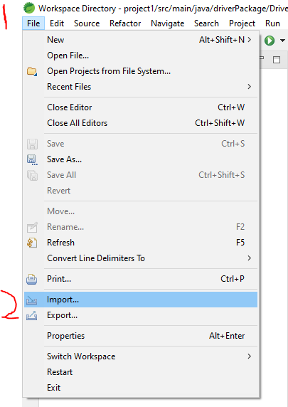
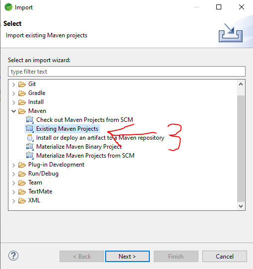
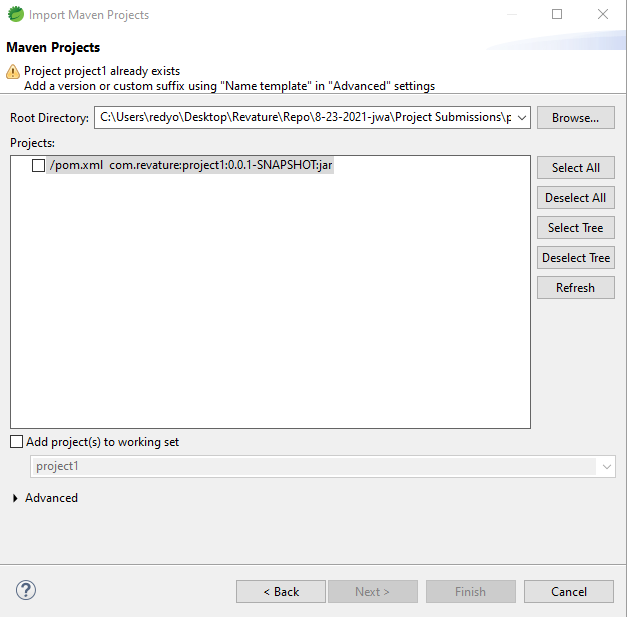

# Project_1_Reimbursement_Request_System

## Project Description

The purpose of this project is for employees and managers to be able to log in. Once logged in, an employee can make a request to be reimbursed for a certain amount of money. A manager meanwhile can make either approve or deny requests that are submitted by any user, as well as see statistics about all the requests.

## Technologies Used

* JavaScript
* HTML 5 
* CSS, SQL 
* Postman 
* AWS RDS 
* Java 8 
* Javalin 
* Hibernate
* MariaDB
* DBeaver
* Maven
* Spring Tools Suite 4

## Features

* Creates a database system that keeps track of requests, as well as a list of users of who can log in.
* Allows the employee to create an request.
* Allows managers to approve and deny requests.
* Allows managers to see statistics about the requests.

To-Do List:
* Clean up the front end to make it much more user friendly.
* Add more statistical Data to the statistics view on manager. 

## Getting Started

First you should begin by cloning this repository. The image below shows the command you should be using in GIT.

Next Make sure you have the latest version of DBeaver, Spring Tools Suite, and have a fresh, empty database hosted on AWS or your prefered web service database.

Next go to Spring Tools Suite 4 and open the IDE. From there you will begin to import the folder as a maven project shown below. 

Then select the type of project you wish to import. In this case, its an existing maven project

Now select The project1 folder that you have pulled from this repo. Note, I already have this in my IDE so it says it already exists, but it shouldn't exist for you. You have done it correctly when you see the pom.xml listed in the box and it is checkmarked.

## Usage

