# Project_1_Reimbursement_Request_System

## Project Description

The purpose of this project is for employees and managers to be able to log in. Once logged in, an employee can make a request to be reimbursed for a certain amount of money. A manager meanwhile can make either approve or deny requests that are submitted by any user, as well as see statistics about all the requests.

## Technologies Used

* JavaScript
* HTML 5 
* CSS, SQL 
* Postman 
* AWS RDS 
* Java 8 
* Javalin 
* Hibernate
* MariaDB
* DBeaver
* Maven
* Spring Tools Suite 4

## Features

* Creates a database system that keeps track of requests, as well as a list of users of who can log in.
* Allows the employee to create an request.
* Allows managers to approve and deny requests.
* Allows managers to see statistics about the requests.

To-Do List:
* Clean up the front end to make it much more user friendly.
* Write More Tests for the Service and DAO layers of the application.

## Getting Started

First you should begin by cloning this repository. The image below shows the command you should be using in GIT.

Next Make sure you have the latest version of DBeaver, Spring Tools Suite, Postman, and have a fresh, empty database hosted on AWS or your prefered web service database.

Next go to Spring Tools Suite 4 and open the IDE. From there you will begin to import the folder as a maven project shown below. 

Then select the type of project you wish to import. In this case, its an existing maven project

Now select The project1 folder that you have pulled from this repo. Note, I already have this in my IDE so it says it already exists, but it shouldn't exist for you. You have done it correctly when you see the pom.xml listed in the box and it is checkmarked.

Now that we have our folder ready to go, we now need to create the database with DBeaver. 

First, open Dbeaver, and you will notice the button below in the top left hand corner, you want to click to so that you can add a server.
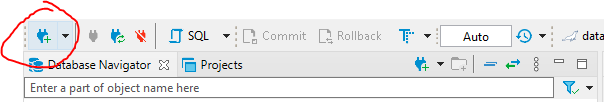

Now enter the appropriate Information based on what is correct for your database server. Make sure its the right endpoint, username, password, and port number. 

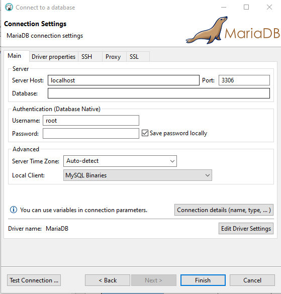

Now right click databases, and click on "Create New DataBase" as shown below, after that you will get a popup to name the database. You will want to remember that for later.

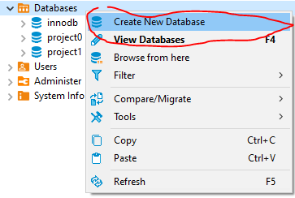

Now back to Spring Tools Suite 4, open the connection.properties File that is in the project. It should be located under src/main/resource

You will want to put in the correct credentals to your database and its related endpoints. For security reasons, I have left out the credentials of my database i used in this project, since it can lead to other people hacking the database. 

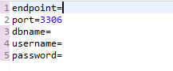

Next go over to your package structure and open the driver file that is locoated and highlighted below.

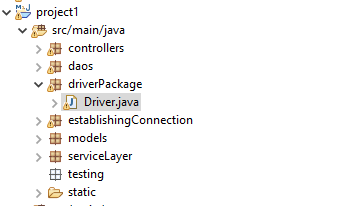

Then click the green arrow on the upper left circled in the below image. If asked where you want to run it, run it as a java console application.

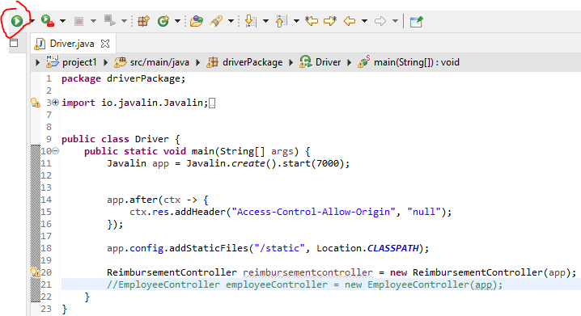

Next go to postman, and run the shown get request. From here it should create the datbase structure inside the database you specified inside of your connection.properties file. The request should return an empty set. 

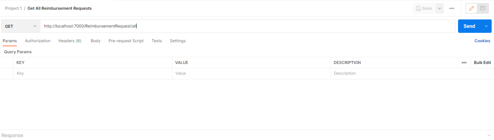

Now go ahead and head back to Spring Tools and stop the program for the time being. You can stopo it by clicking on the big red pause button shown below.

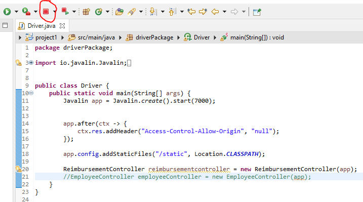

Next, head back to DBeaver, and go ahead and create a script for our brand new database shown below

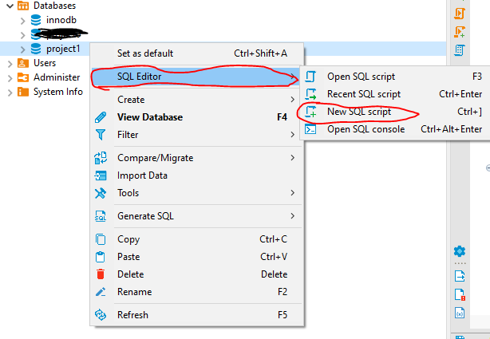

Now in order to use the program to its fullest extent, we need to manually add in some users that can sign into the program. By writing the below lines of code inside the script, and then highlighting one line at a time,  we can add these two users into our database. You are free to change the usernames, and passwords of these users as you see fit. The last TRUE or FALSE field, decides if they are a manager, or not. Managers have different roles compared to normal users.

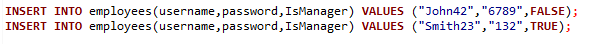

And to run a line of script, you highlight the line you want to run, and press the button below on the side of the script. 

Now the program should be ready for use!

## Usage

Now, lets start the program and head to the following URL.

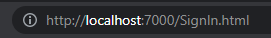

Here we can see the login page for our application.

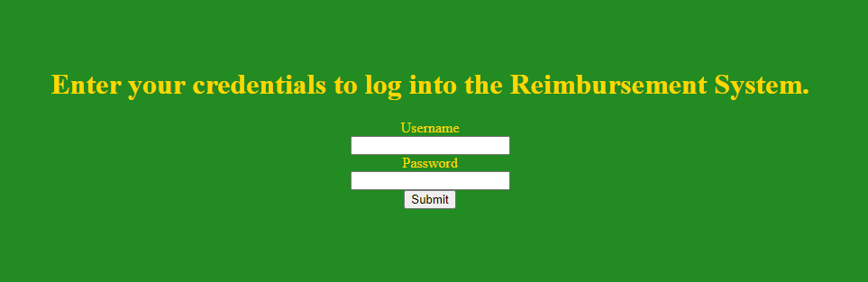

Lets begin by logging in as our first user.

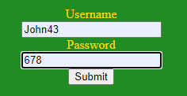

Once logged in we can see many things that are located on the page, a table that displays all the requests that the user has made, as well as a forum to create a new reimbursement request.

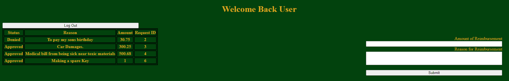

We can make the request like so, asking for an amount of money, and then a reason as well. 

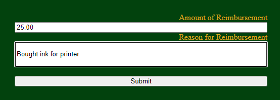

We would see that the request table is updated with a new request.

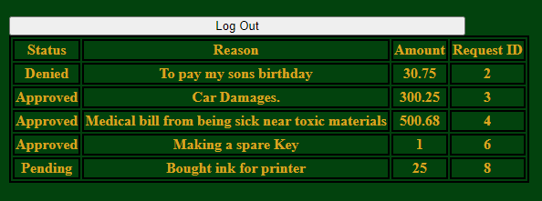

Now we will click the log out button and it will take us back to the login page. We will now log in as a different employee as shown below.

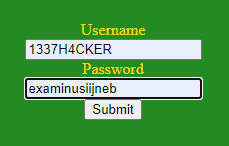

Notice how that the requests made by our first employee does not show up in this employee's request table. 

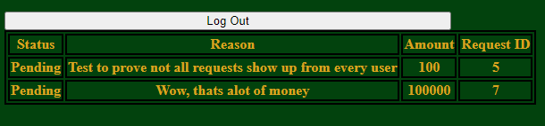

Like normal, we can also create a request like shown below, and submit it to update the request table.

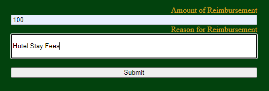

Now we will login as a manager as shown below, notice it looks just like an employee logging in.

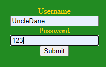

When redirected, we are greeted by the manager page, we can see that ALL requests that have ever been made are showing up on the left, and on the right we have a forum that allows us to update the status of requests to either approve or deny reimbursement requests.

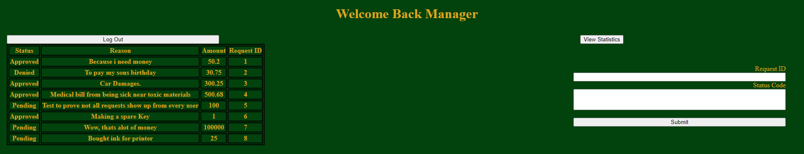

The following is how you approve a request.

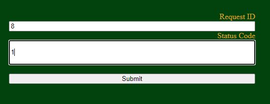

And the following is how you deny a request. 

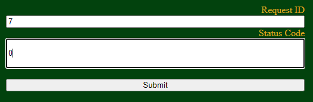

As we can see on the left, after submitting both status updates, one request has now been approved, and one request has now been denied.

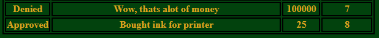

If we click the "View Statistics" Button on that page, we are taken to the statistics page shown below. This is where all statistics about the many requests that have been made display. If we wanted to head back to the manager page, we can click the "go back" button.

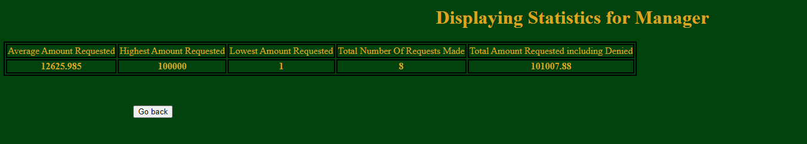
